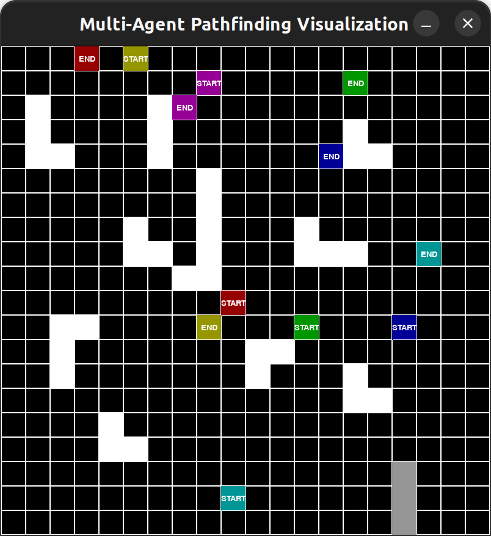
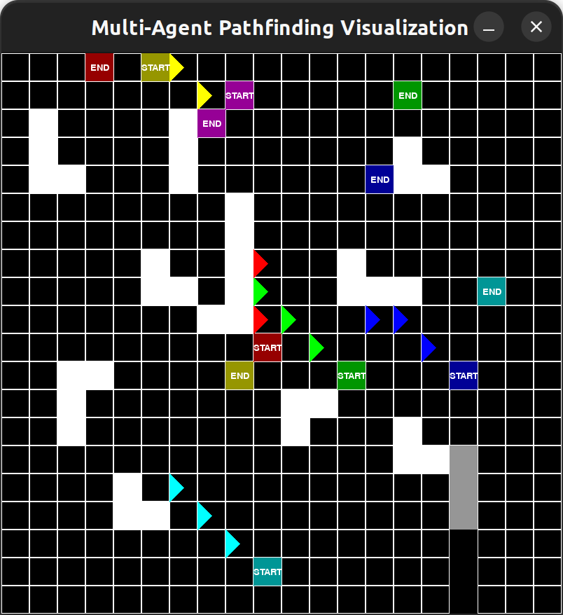

# Multi-Agent Path Planning in Dynamic Gridworld
## Introduction
As an individual new to the domain of path planning, this project serves as a journey into some of the conventional path planning methods. The focus of this project centers on the applications of A* in multi-agent path planning scenarios, particularly within the context of holonomic robots navigating environments replete with both stationary and dynamic obstacles.

## Gridworld Setup
The grid world game is a very classical application of reinforcement learning. Configured as a 20 x 20 grid, this environment encapsulates essential components crucial for developing and evaluating path planning algorithms. We assume the robot starts in the top left corner of the board, to navigate through the grid to reach the end state. Strategic obstacles, marked in white, are interspersed throughout the grid, posing challenges that necessitate the robot's ability to learn optimal paths while avoiding collisions. Dynamic obstacles, marked in grey, add an additional layer of complexity, as their positions update with each time step. Using a graph-based algorithm like A* allowed us to take advantage of pre-existing knowledge of the environment, to make a more complex grid world, with 6 triangular agents with random start and end states, along with static and dynamic obstacles.


 

_The initial environment (left) and the environment with the path lines of agents (represented by triangles) after 3 time steps (right). Static obstacles are in white and the dynamic obstacle is in gray_

``` python
WIDTH = 800
ROWS = 20
COLS = 20
OBSTACLES = [(5, 8), (6, 8), (7, 8), (8, 8), (9, 8), (9, 7), (7, 5), (8, 5), (8, 6), (12, 10), (13, 10), (12, 11), (4, 14), (4, 15), (3, 14), (2, 6), (3, 6), (4, 6), (15, 4), (16, 4), (16, 5), (14, 14), (14, 15), (13, 14), (4, 1), (4, 2), (3, 1), (2, 1), (7, 12), (8, 12), (8, 13), (8, 14), (12, 2), (13, 2), (11, 2), (11, 3)]
GRID_SIZE = WIDTH // COLS
```
